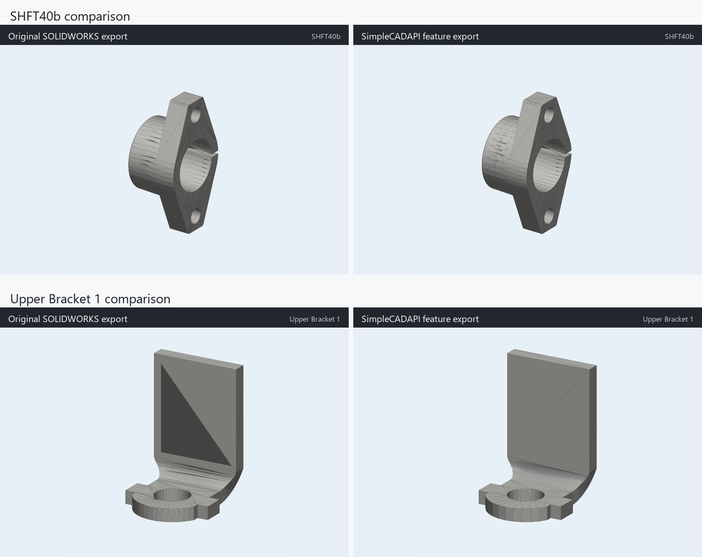

# sw2cadir

`sw2cadir` 是一个实验性的 SOLIDWORKS 特征树到 [SimpleCADAPI](https://github.com/NiJingzhe/SimpleCADAPI) 代码转换器。

它不是把 STEP/STL 网格重新拟合成 CAD，而是通过 SOLIDWORKS 本体 COM API 读取零件的特征顺序、草图坐标系、线/圆弧/圆、轮廓、选择集、特征作用体和每一步 MassProperty，再生成逐特征的 SimpleCADAPI Python 脚本。



上图左侧是 SOLIDWORKS 参考模型渲染，右侧是本工具生成的 SimpleCADAPI 模型渲染。

## 当前能力

- 读取 `.SLDPRT` 的特征树和草图几何。
- 生成显式的 SimpleCADAPI 代码，每个 SOLIDWORKS 几何特征对应一段生成代码。
- 支持当前已实现的特征类型：`Extrusion`、`ICE`、`Cut`、`Revolution`、`RevCut`、`SMBaseFlange`。
- 支持线段、圆弧、圆草图轮廓。
- 对拉伸/切除方向、旋转切除镜像位置等歧义，用 SOLIDWORKS 每步 MassProperty 后状态做候选匹配。
- 生成 `operation_trace.json`，记录 SOLIDWORKS 特征到 SimpleCADAPI 操作的对应关系。

尚未覆盖的内容包括复杂曲面、放样、扫描、圆角/倒角的完整参数化重建、装配体和工程图。螺纹装饰目前不重建，只保留真实切除/旋转几何。

## 安装

本工具需要 Windows、SOLIDWORKS 本体、Python 3.10+。

```powershell
git clone https://github.com/Yulia2233/sw2cadir.git
cd sw2cadir
py -m venv .venv
.\.venv\Scripts\Activate.ps1
pip install -r requirements.txt
pip install -e .
```

如果你的 SOLIDWORKS 类型库不在默认路径，可以设置：

```powershell
$env:SOLIDWORKS_TLB = "C:\Program Files\SOLIDWORKS Corp\SOLIDWORKS\sldworks.tlb"
```

## 基本流程

1. 从 SOLIDWORKS 提取特征树：

```powershell
sw2cadir-extract ".\parts\part_a.SLDPRT" ".\parts\part_b.SLDPRT" `
  --out-dir extracted `
  --hints examples\conversion_hints.example.json
```

2. 生成 SimpleCADAPI 代码：

```powershell
sw2cadir-generate --extracted-dir extracted --out-dir generated
```

3. 运行生成模型并导出 STEP/STL：

```powershell
python generated\<model_name>\model.py
```

4. 检查特征覆盖和转换 trace：

```powershell
sw2cadir-audit --extracted-dir extracted --models-dir generated
```

5. 如果本机还有原始 `.SLDPRT`，可以用 SOLIDWORKS MassProperty 做精度验证：

```powershell
sw2cadir-verify --manifest verification_manifest.json --out-dir verification
```

`verification_manifest.json` 是一个列表，每个模型包含 `name`、`part`、`json`、`model` 字段。可以参考 `examples/verification_manifest.example.json`。

## Examples

本仓库随带了本次转换的两个模型：

- `examples/shft40b/model.py`
- `examples/shft40b/shft40b_featured.step`
- `examples/upper_bracket_1/model.py`
- `examples/upper_bracket_1/upper_bracket_1_featured.step`
- `examples/comparison/all_featured_comparison.png`

重新运行 example：

```powershell
python examples\run_all.py
```

这会重新执行两个 `model.py`，并在对应目录下导出新的 STEP、STL、build report 和 operation trace。

## 本次转换结果

使用 SOLIDWORKS MassProperty 对生成模型做精确体积检查：

| 模型 | 几何特征覆盖 | 体积差 mm^3 | 表面积差 mm^2 | 实体数 |
| --- | ---: | ---: | ---: | ---: |
| SHFT40b | 10/10 | +0.025400021 | +0.001760740 | 1 |
| Upper Bracket 1 | 3/3 | -0.000009172 | +0.198041656 | 1 |

`Upper Bracket 1` 的最后一个跨折弯法向切除使用了等效的折弯采样切刀，因此表面积仍有约 `0.20 mm^2` 的残差；体积已经基本对齐。`SHFT40b` 的主要残差来自一个双向凸台特征的内核布尔差异，当前体积误差约为 `0.000038%`。

## 目录结构

```text
sw2cadir/
  sw2cadir/
    extract_sw_features.py       # SOLIDWORKS COM 特征提取
    generate_simplecadapi.py     # 生成显式 SimpleCADAPI model.py
    runtime.py                   # 草图、轮廓、拉伸/切除/旋转等转换运行时
    audit_feature_coverage.py    # 特征覆盖和通用性检查
    verify_outputs.py            # 与 SOLIDWORKS MassProperty 对比
  examples/
    shft40b/
    upper_bracket_1/
    comparison/
```

## 注意

- 提取阶段必须使用 SOLIDWORKS 本体 API；eDrawings/File Utilities 不暴露完整历史特征树。
- 原始 `.SLDPRT` 文件没有放进仓库，examples 中保存的是提取后的 feature JSON、生成代码、STEP 和对比图。
- 这是特征级转换器，不是完整 SOLIDWORKS 克隆。遇到新特征类型时，应优先扩展 `runtime.py` 的通用规则，而不是针对单个零件写硬编码分支。
